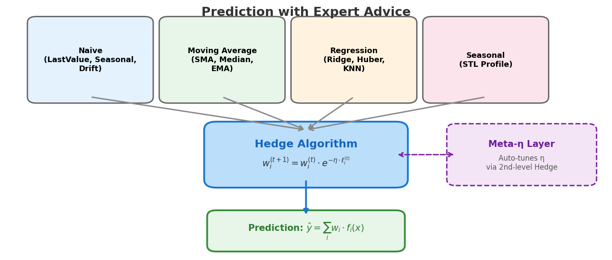
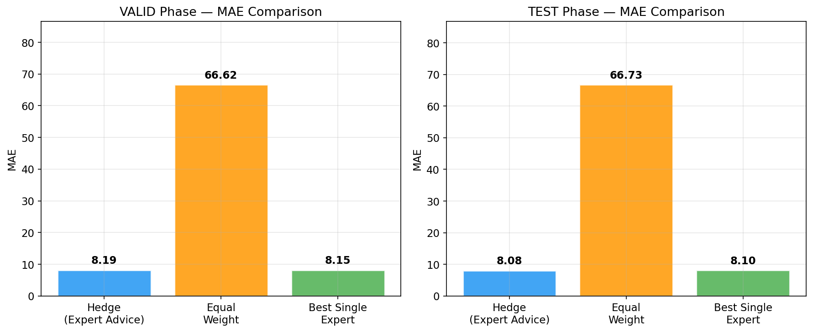
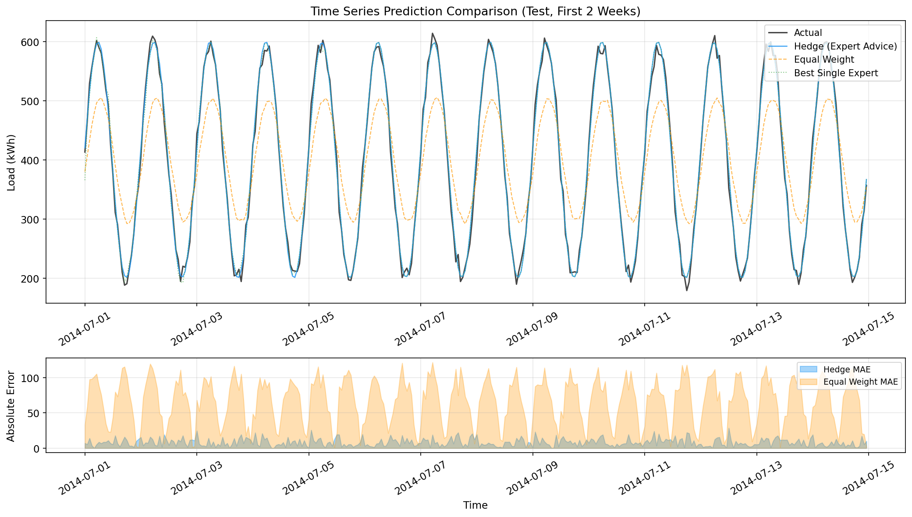
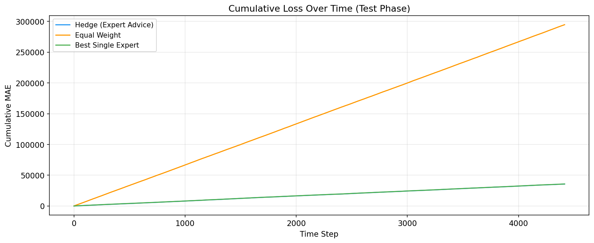
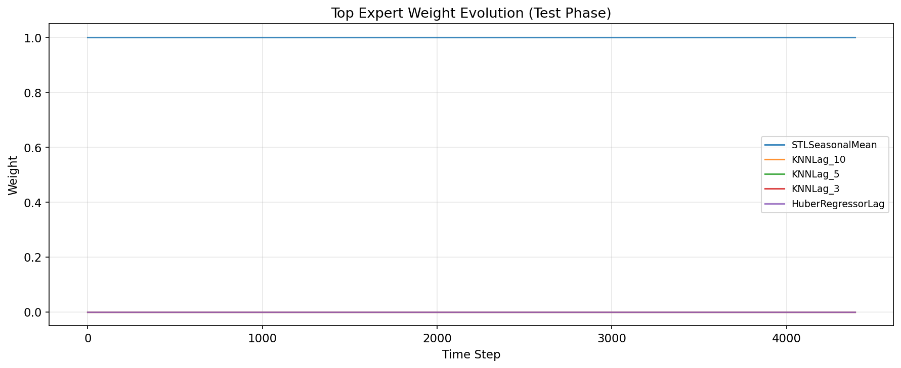

# Expert Advise

**Prediction with Expert Advice** の枠組みを用いた電力負荷予測アンサンブルシステム。30〜80の軽量Expertの予測をHedgeアルゴリズムで動的に重み付けし、オンライン学習で継続的に最適化します。

## アルゴリズム概要

### Prediction with Expert Advice

本システムは、オンライン学習理論における **Prediction with Expert Advice** の枠組みに基づいています。各時刻で複数のExpert（予測器）が予測を出し、過去の実績に基づく重みで統合することで、事後的に最良のExpertに匹敵する性能を達成します。



### Hedge アルゴリズム

各Expertの重みを指数的に更新する multiplicative weights アルゴリズムです。

**重み更新則:**

$$w_i^{(t+1)} = w_i^{(t)} \cdot e^{-\eta \cdot \ell_i^{(t)}}$$

- $w_i^{(t)}$: 時刻 $t$ における Expert $i$ の重み
- $\ell_i^{(t)}$: 時刻 $t$ における Expert $i$ の損失 (MAE)
- $\eta$: 学習率（大きいほど損失の大きい Expert を素早く下方修正）

**アンサンブル予測:**

$$\hat{y}^{(t)} = \sum_{i=1}^{N} \bar{w}_i^{(t)} \cdot f_i(x^{(t)})$$

ここで $\bar{w}_i$ は正規化された重み（softmax）です。数値安定性のため対数重み空間で管理しています。

### Meta-η（二段Hedge）

学習率 $\eta$ の選択を自動化する仕組みです。複数の $\eta$ 候補（デフォルト: $2^{0}, 2^{-1}, \ldots, 2^{-10}$）それぞれに独立したHedgeインスタンスを持ち、メタレベルのHedgeが最適な $\eta$ を追跡します。

```
η候補: [1.0, 0.5, 0.25, ..., 0.001]
       ↓     ↓     ↓           ↓
    Hedge₁ Hedge₂ Hedge₃ ... Hedge₁₁   ← 各ηでExpert重みを独立管理
       ↓     ↓     ↓           ↓
    pred₁  pred₂  pred₃  ... pred₁₁
       ↓     ↓     ↓           ↓
    ========== Meta Hedge ==========    ← メタレベルで最良のηを追跡
                  ↓
            最終予測 ŷ
```

### Expert群の構成

4カテゴリ・約30種類（`light30`プリセット）のExpertを使用します:

| カテゴリ | Expert | パラメータ例 | 数 |
|---------|--------|------------|---:|
| **Naive** | LastValue, SeasonalNaive, Drift | season=24,48,168h; window=24,168h | 6 |
| **Moving Average** | SMA, Median, EMA | window=12-336h; α=0.05-0.7 | 7+ |
| **Regression** | RidgeLag, HuberLag, KNNLag | α=0.1-10; k=3-10 | 5 |
| **Seasonal** | STLSeasonalMean | 7×24 曜日×時間プロファイル | 1 |

## 結果

以下は合成データ（正弦波+ノイズ）での実験結果です。`scripts/generate_readme_figures.py` で再現できます。

### 手法別MAE比較

Hedge（Expert Advice）、等重み平均、最良単一Expertの3手法を比較:



### 時系列予測比較

テスト期間における実測値と各手法の予測値:



### 累積損失推移

時間経過に伴う累積MAEの推移。Hedgeは重みの適応的な更新により、等重み平均に対して累積損失を抑えます:



### Expert重み推移

Hedgeアルゴリズムが各Expertにどのように重みを配分しているかの変遷:



## セットアップ

```bash
pip install -e ".[dev]"
```

または [uv](https://docs.astral.sh/uv/) を使う場合:

```bash
uv sync --all-extras
```

## 使い方

### 実験の実行

```bash
# 基本実行（5系列サンプル、light30 Expert群）
python -m src.run_experiment --data-path data/raw/ --experts light30 --series-sample 5

# Meta-η + 80 Expert群で全系列実行
python -m src.run_experiment --data-path data/raw/ --experts light80 --eta-mode meta_grid

# 固定η + 損失スケーリング変更
python -m src.run_experiment --data-path data/raw/ --eta-mode fixed --etas 0.1 --scale-loss relative
```

### README図の再生成

```bash
uv run python scripts/generate_readme_figures.py
```

### テスト

```bash
pytest tests/ -v
```

## プロジェクト構成

```
expert-advise/
├── src/
│   ├── run_experiment.py        # 実験ループ・CLI
│   ├── report.py                # レポート・プロット生成
│   ├── data/
│   │   ├── load_uci.py          # UCIデータ読み込み
│   │   ├── preprocess.py        # 前処理（リサンプル・欠損補完・外れ値処理）
│   │   └── split.py             # Train/Valid/Test 時系列分割
│   ├── ensemble/
│   │   ├── hedge.py             # Hedge アルゴリズム
│   │   ├── meta_eta.py          # Meta-η Hedge（二段Hedge）
│   │   ├── loss.py              # 損失関数（MAE, sMAPE, RMSE）
│   │   └── scaling.py           # 損失スケーリング
│   └── experts/
│       ├── factory.py           # Expert一括生成（light30/light80）
│       ├── naive.py             # LastValue, SeasonalNaive, Drift
│       ├── moving_avg.py        # SMA, Median
│       ├── smoothing.py         # EMA
│       ├── regression.py        # RidgeLag, HuberLag, KNNLag
│       └── seasonal_profile.py  # STLSeasonalMean
├── scripts/
│   └── generate_readme_figures.py  # README図生成
├── tests/                       # テストスイート
├── data/                        # UCI Electricity データ
├── docs/                        # 仕様書・図表
│   └── figures/                 # README用図
└── reports/                     # 実験出力
```

## 参考文献

1. **Cesa-Bianchi, N. & Lugosi, G.** (2006). *Prediction, Learning, and Games*. Cambridge University Press.
   - Expert Advice の理論的基盤
2. **Freund, Y. & Schapire, R.E.** (1997). A decision-theoretic generalization of on-line learning and an application to boosting. *Journal of Computer and System Sciences*, 55(1), 119-139.
   - Hedge アルゴリズムの原論文
3. **de Rooij, S., van Erven, T., Grünwald, P.D., & Koolen, W.M.** (2014). Follow the leader if you can, hedge if you must. *Journal of Machine Learning Research*, 15, 1281-1316.
   - Meta-learning rate の理論
4. **UCI Machine Learning Repository** — Electricity Load Diagrams 2011-2014.
   - 実験データソース
